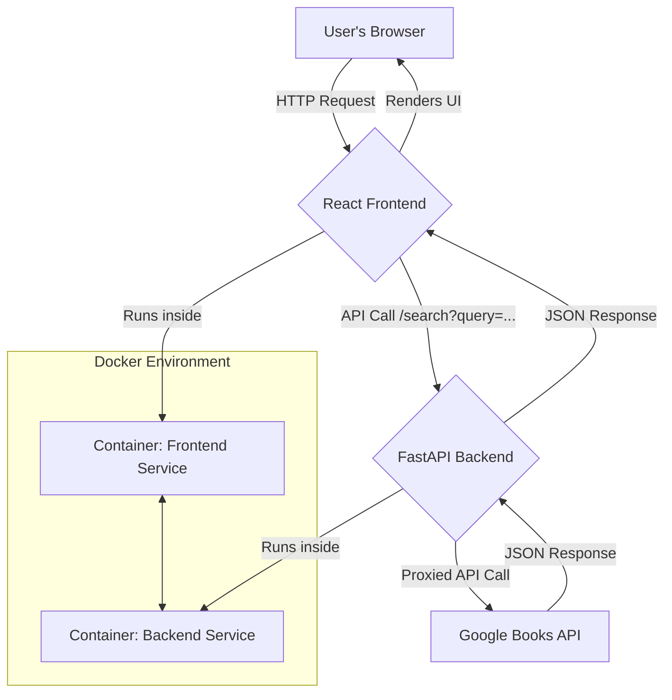

# Project Requirements Analysis

## 📋 Project Overview
This document outlines the requirements for a full-stack web application named "book_finder". The application will provide a simple user interface for searching books via the public Google Books API. The system will be composed of a React frontend and a FastAPI backend, orchestrated using Docker Compose for ease of development and deployment.

## 🎯 Core Requirements

### Functional Requirements
1.  **Book Search:** The user must be able to enter a search term (e.g., "Dune", "1984") into a text input field on the web page.
2.  **Initiate Search:** The user can trigger the search by pressing a "Search" button or hitting the "Enter" key in the input field.
3.  **Backend Data Fetching:** The frontend will send the user's search term to a backend API endpoint.
4.  **API Proxy:** The backend will receive the search term and act as a proxy, making a request to the Google Books API (`https://www.googleapis.com/books/v1/volumes`) with the provided query.
5.  **Display Results:** The frontend will receive a list of books from the backend and dynamically render them on the page.
6.  **Result Information:** Each book in the displayed list must show its **Title** and **Author(s)**.
7.  **No Results:** If a search yields no results, the application should display a clear message to the user (e.g., "No books found.").
8.  **Loading State:** The UI should indicate when a search is in progress (e.g., displaying a "Loading..." message).

### Non-Functional Requirements
1.  **Containerization:** The entire application (frontend and backend) must be runnable with a single `docker-compose up` command.
2.  **Configuration:** The URL for the backend API should be configurable for the frontend via an environment variable.
3.  **Styling:** The user interface should be clean, minimal, and user-friendly. It should be properly centered and readable.
4.  **Code Readability:** The code for both services should be well-structured and documented where necessary.

## 🛠️ Technical Stack

| Component | Technology           | Reason                                                          |
| :-------- | :------------------- | :-------------------------------------------------------------- |
| Frontend  | React                | A popular and powerful library for building interactive UIs.    |
|           | Axios                | For making promise-based HTTP requests to the backend API.      |
| Backend   | Python 3 / FastAPI   | A modern, high-performance web framework for building APIs.     |
|           | Requests             | A simple, standard library for making HTTP requests in Python.  |
|           | Uvicorn              | An ASGI server to run the FastAPI application.                  |
| Orchestration | Docker & Docker Compose | To create a consistent, isolated, and easily reproducible development environment. |

## 📐 Architecture
The application will follow a **Client-Server architecture** with a decoupled frontend and backend.

1.  **Frontend (Client):** A single-page application (SPA) built with React. It is responsible for rendering the UI and managing user interactions. It will run in its own Docker container.
2.  **Backend (Server):** A RESTful API built with FastAPI. It serves as a **Backend-for-Frontend (BFF)**. Its primary role is to act as a secure proxy between the client and the external Google Books API. This prevents exposing any potential API keys to the client and allows for data shaping. It will run in a separate Docker container.
3.  **Container Orchestration:** Docker Compose will define and manage the multi-container application. It will set up a network for the containers to communicate, manage port mappings, and handle environment variable injection.



## ✅ Success Criteria
The project will be considered complete and successful when:
1.  The command `docker-compose up --build` successfully starts both the frontend and backend services without errors.
2.  The user can navigate to the specified frontend port (e.g., `http://localhost:3000`) and see the "Book Finder" application interface with a search bar.
3.  Entering a term like "Hitchhiker's Guide" and initiating a search returns a list of books, with each entry displaying a title and author.
4.  Submitting an empty search query does not crash the application.
5.  Searching for a non-existent term (e.g., "asdfghjkl") results in a "No books found" message being displayed to the user.
6.  The backend API endpoint `/search` is not directly accessible from the public internet, only through the frontend's requests within the Docker network.

## ⚠️ Risks & Considerations
1.  **CORS (Cross-Origin Resource Sharing):** The FastAPI backend will be running on a different origin than the React frontend. The backend must be configured with CORS middleware to explicitly allow requests from the frontend's origin.
2.  **API Rate Limiting:** The Google Books API may have rate limits. While unlikely to be an issue for this small application, the backend should gracefully handle non-200 responses (e.g., 429 Too Many Requests, 5xx Server Errors) from the external API and return a meaningful error to the client.
3.  **Data Parsing:** The structure of the JSON response from the Google Books API can be complex. The backend parsing logic must be robust enough to handle missing fields, such as a book having no `authors` property.
4.  **Environment Variable Handling:** The React application needs the backend URL at runtime. This will be passed as an environment variable (`REACT_APP_BACKEND_URL`) in the `docker-compose.yml` file, which is the standard mechanism for `create-react-app`.

## 📦 Deliverables
The final output will be a directory named `book_finder` containing the following file structure and runnable code:

```
book_finder/
├── .env.example
├── .gitignore
├── docker-compose.yml
├── backend/
│   ├── main.py
│   ├── requirements.txt
│   └── README.md
└── frontend/
    ├── package.json
    ├── public/
    │   └── index.html
    ├── src/
    │   ├── App.css
    │   ├── App.js
    │   └── index.js
    └── README.md
```